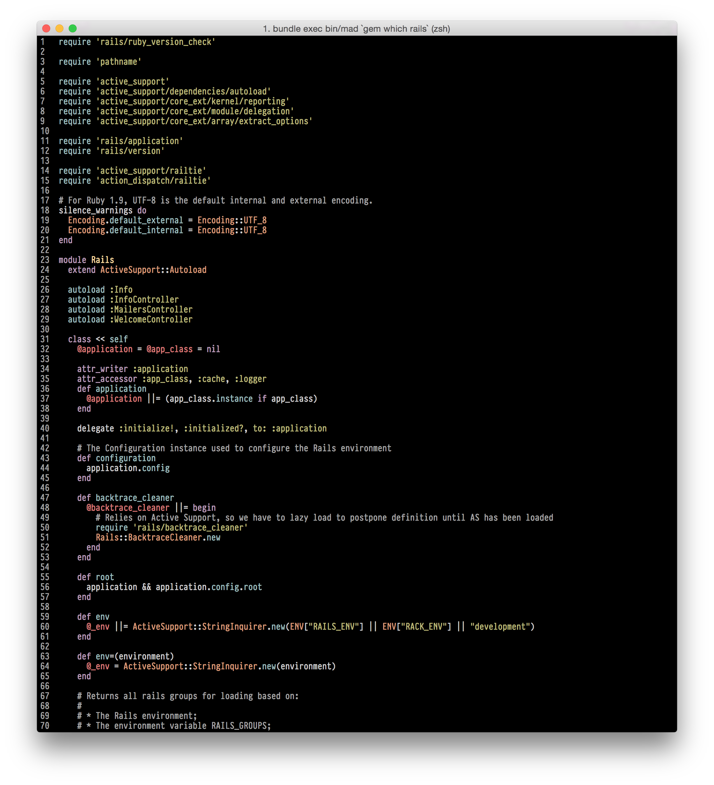
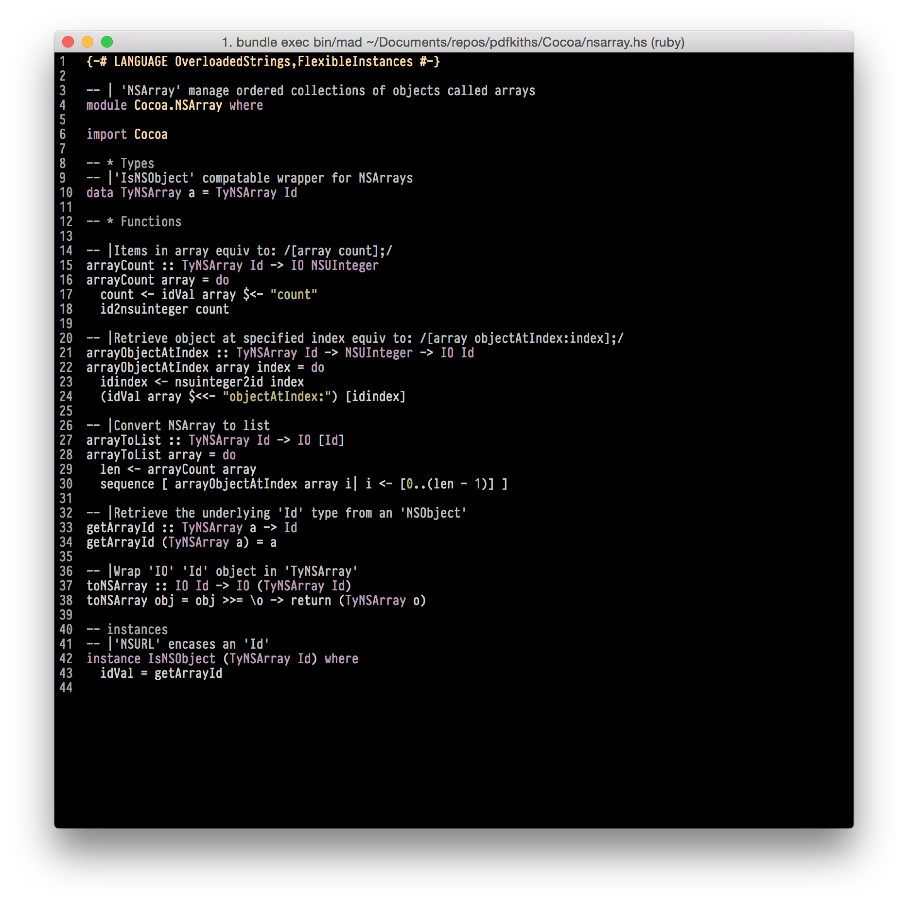

# Mad

## Installation

install it:

    $ gem install mad

## Usage

TODO: Write usage instructions here

## Contributing

1. Fork it ( https://github.com/aktowns/mad/fork )
2. Create your feature branch (`git checkout -b my-new-feature`)
3. Commit your changes (`git commit -am 'Add some feature'`)
4. Push to the branch (`git push origin my-new-feature`)
5. Create a new Pull Request
